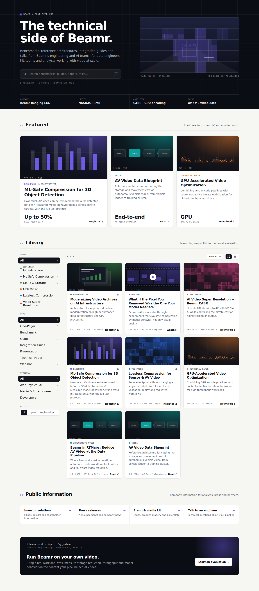

# Beamr Developer Hub (Framer code component)

`DeveloperHub.tsx` is a single, self-contained Framer code component: a searchable library of technical resources for data engineers, ML teams and analysts, with an optional HubSpot registration gate per item.



## Install in Framer

1. Assets → Code → **+** → New file, name it `DeveloperHub.tsx`, paste the file.
2. Drag **DeveloperHub** onto the page. Set width to **Fill** and height to **Auto**.
3. Everything is edited in the right-hand properties panel.

### Recommended setup: native layers + library component

On Beamr's `/dev_hub` page the header, Public information and CTA are **native Framer layers** (text styles in the *Dev Hub* folder), so text and images are edited directly on the canvas. The component runs with **Header**, **Public info** and **Evaluation CTA** turned off and only renders the interactive part: featured items, search, filters, library and the registration pop-up. With the header off, the search box moves into the library toolbar.

Every remaining label is a control: section titles and notes, filter labels (**Labels**), sort options, CTA command lines. When the header is on, **Header image** replaces the generated frame visual.

The layout responds to the component's own width (CSS container queries), so it works in every Framer breakpoint without separate variants.

## Content: three ways to manage it

Use the **Content** control to choose a source.

| Mode | Use when |
|---|---|
| **Framer panel** (default) | Editors add, reorder and edit resources in the panel. PDFs, decks, videos and zips can be uploaded directly (**Upload**). Covers can be uploaded too (**Cover**). |
| **Feed / HubDB** | Marketing manages resources in HubSpot (or any CMS that serves JSON) and publishing doesn't require Framer. |
| **Both** | Panel items first, then feed items. Duplicate IDs are skipped. |

Topic, type and audience filters come from the content itself, so a new topic shows up in the sidebar automatically, with its own color.

### Resource fields

| Field | Notes |
|---|---|
| `title`, `description` | Required title |
| `type` | Benchmark, Guide, Technical Paper, Webinar, One-Pager, Presentation, Integration Guide… Also picks the generated cover art |
| `topic` | Drives the topic filter and color |
| `audience` | e.g. `AV / Physical AI`, `Developers`, `Media & Entertainment` |
| `format` | `PDF`, `Web`, `Video`, `Slides`, `Code`, `Dataset` |
| `date` | ISO date, timestamp, or `Sep 2026` |
| `file` / `href` | Uploaded file wins over link |
| `image` | Optional cover. Without one, a cover is generated from the type and topic color |
| `size` | Optional, e.g. `2.4 MB` |
| `featured` | Shown in the Featured row (first three) |
| `gated` | Requires registration before opening |
| `formId` | Optional per-item HubSpot form override |
| `metric`, `metricLabel` | Big number on featured cards |
| `id` | Slug; auto-generated from the title when empty. Cards get `id="resource-<id>"` for deep links |

### HubSpot HubDB setup

1. HubSpot → Content → HubDB → **Create table** `devhub_resources`.
2. Add columns with the names above. Suggested types: `title`, `description`, `type`, `topic`, `audience`, `format`, `size`, `metric`, `metric_label`, `form_id`, `href` → Text; `date` → Date; `file` → File; `image` → Image; `featured`, `gated` → Boolean (checkbox). Select columns also work; their label is used.
3. Table settings → enable **Allow public API access**, then **Publish**.
4. In Framer set **Content** to *Feed / HubDB* and **Feed URL** to:

   ```
   https://api.hubapi.com/cms/v3/hubdb/tables/devhub_resources/rows?portalId=<PORTAL_ID>
   ```

Any other JSON source works too: a plain array of resource objects, or an object with `results`, `items` or `resources`.

## Registration gate

1. Create a dedicated HubSpot form (portal `144465530` is preset) with at least the fields listed under **Fields** (default: `firstname`, `lastname`, `email`, `company`, `jobtitle`).
2. Set **HubSpot portal** and **HubSpot form** (the form GUID) in Framer, and the **Region** (`na1`/`na2`/`eu1`).
3. Toggle **Gate → Register** on the items that need it.

Options:

- **Form → Native**: a form styled like the hub that submits to the HubSpot Forms API with the `hubspotutk` cookie, page URL and title, so submissions attribute to the visitor's HubSpot contact and session. Every field name must exist on the HubSpot form or HubSpot rejects the submission. The rejection message is shown in the modal.
- **Form → HubSpot embed**: renders the form exactly as built in HubSpot (progressive fields, consent checkboxes, dependent fields). Use it if legal consent options are required.
- **Resource field**: the name of an optional hidden contact property (e.g. `devhub_resource`) that receives the title of the requested resource. It has to exist on the form.
- **Unlocks**: *All gated* (one registration unlocks the whole hub) or *That item*. Unlocks are kept in the visitor's browser (`localStorage`).

The gate is a soft gate: file URLs are present in the page code. For material that must not leak, link gated items to a HubSpot file or landing page that requires a form submission, instead of a public file URL.

### Analytics

Events are pushed to `window.dataLayer` (GTM/GA4): `devhub_gate_view`, `devhub_gate_submit`, `devhub_resource_open`, each with `resource_id`, `resource_title`, `resource_type`.

## Design notes

- A dark technical header with a per-block bit-allocation frame visual. A light body with docs-style sidebar filters, grid and list views, sorting, and `/` to focus search.
- Covers are generated SVG figures per type: benchmark bars, pipeline diagram, bitrate curve, film strip, slides, macroblock map. They're colored by topic, and an uploaded cover image replaces them.
- Accent, text, dark and background colors, per-topic colors, fonts (default Inter + JetBrains Mono) and max width are all controls.
- Facts strip and Public information links are editable arrays. **Verify the default facts and replace the `#` links** before publishing.
