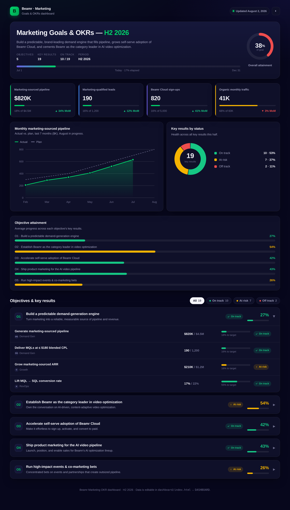

# Beamr Marketing OKR Dashboard

A single-file, self-contained dashboard to track Beamr's marketing goals and OKRs
for **H2 2026**. No build step, no dependencies — just `index.html`.



## What it shows

- **Overall attainment** ring + time-elapsed bar for the half.
- **KPI tiles** — the four headline numbers (pipeline, MQLs, Cloud sign-ups, traffic).
- **Trend chart** — monthly marketing-sourced pipeline, actual vs. plan, with a hover crosshair.
- **Status donut** — every key result bucketed by RAG status (on track / at risk / off track / achieved).
- **Objective attainment** bars — average progress per objective.
- **Objectives & key results** — expandable cards with owner, current → target, progress, and status. Filter by status.
- **Light / dark** theme toggle (dark by default, on brand).

## Editing the data

Everything is driven by a single object. Open `index.html` and edit the block marked:

```js
/* ▓▓▓  EDIT YOUR DATA HERE  ▓▓▓ */
const DASHBOARD = { ... };
/* ============  END OF EDITABLE DATA  ============ */
```

- `meta` — period, dates, "last updated", and the mission statement.
- `kpis` — the four headline tiles (`value`, `target`, `progress` 0–100, `delta`).
- `trend` — the pipeline line chart (`months`, `actual`, `plan`; use `null` for months not yet reported).
- `objectives[].keyResults[]` — each KR's `name`, `owner`, `current`, `target`, `progress` (0–100), and `status`.

**Status values:** `"on-track"`, `"at-risk"`, `"off-track"`, `"achieved"`, `"not-started"`.
Objective and overall percentages are computed automatically from KR `progress`.

> The numbers shipped here are a realistic **template** — replace them with your real figures.

## Deploying to Vercel

This folder is a zero-config static site.

**Option A — Vercel dashboard**
1. Import the `beamarketing/website` repo in Vercel.
2. Set **Root Directory** to `dashboard`.
3. Framework preset: **Other** (no build command, output = the folder). Deploy.

**Option B — Vercel CLI**
```bash
cd dashboard
vercel        # preview
vercel --prod # production
```

`vercel.json` sets clean URLs and a couple of sensible security headers.
